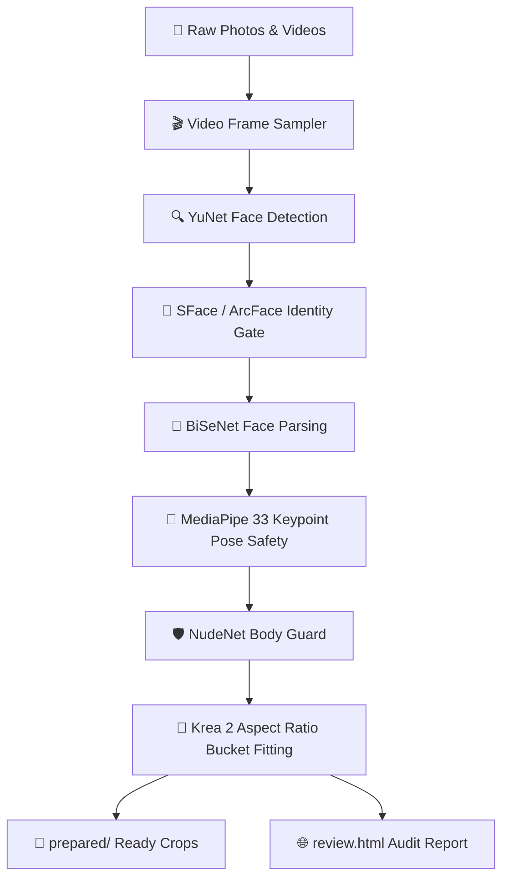

<div align="center">

# 👤 Lora Face Select Lite

**CPU-First Automated Dataset Selector & Smart Body-Aware Cropping Engine for AI Face LoRA Training**

[](#)
[](#)
[](#)
[](#)
[](#)

[**🌐 Explore Web Showcase & Live Simulator**](https://htmlpreview.github.io/?https://github.com/user/lora_face_select_lite/blob/main/docs/index.html)

</div>

---

## 📌 Короткий Огляд (Overview)

`lora-face-select-lite` — це автономний локальний інструмент для автоматичного відбору та підготовки зображень для тренування персональних **Face LoRA** (SD 1.5, SDXL, FLUX, Krea 2). 

Він розроблений за принципом **CPU-First**: увесь пайплайн (детекція, розпізнавання, сегментація обличчя, аналіз суглобів тіла та перевірка безпеки) виконується на CPU за допомогою **OpenCV DNN** та **ONNX Runtime CPU** без використання GPU-пам'яті.

### ✨ Ключові можливості:
- **🎯 Identity & Era Matching**: порівняння 512-d векторів (SFace / ArcFace R50) з 1–5 референсними фото.
- **📐 Smart Krea 2 Bucket Fitting**: авто-кадрування у точні пропорції бакетів (`512x512`, `512x768`, `768x1024` тощо) без апскейлу та спотворень.
- **🦴 Joint & Hair Safety**: MediaPipe Pose (33 точки) й BiSeNet сегментація запобігають зрізанню суглобів (лікті, зап'ястя, коліна) та межі волосся.
- **🎬 Local Video Sampling**: послідовний аналіз відео файлів (`.mp4`, `.mov`, `.webm`) з збереженням чекпоїнтів `video_progress.json`.
- **🛡️ NudeNet Guard**: опціональний аналіз області тіла через ONNX Runtime CPU.
- **🖥️ Native Desktop GUI**: Tkinter GUI з прогрес-баром, діагностикою `doctor` та зручним запуском через `run_gui.bat`.
- **📊 Rich Audit Reports**: інтерактивний `review.html`, `dataset_manifest.csv`, `contact_sheet.jpg`.

---

## 🔄 Пайплайн Обробки (Architecture Workflow)



---

## 🚀 Швидкий Старт (Quick Start)

### 1. Встановлення середовища (Windows PowerShell)

```powershell
# Перейти у папку проекту
cd F:\x_other_mat\AI_project\lora_face_select_lite

# Створити та активувати віртуальне середовище Python 3.12
py -3.12 -m venv .venv-win
.\.venv-win\Scripts\Activate.ps1

# Встановити проект у режимі редагування
python -m pip install -e ".[test]"
```

### 2. Завантаження та перевірка ONNX моделей

```powershell
# Атомарне завантаження моделей із перевіркою SHA-256
python -m lora_face_select_lite download-models --profile stable

# Запуск повної діагностики середовища
python -m lora_face_select_lite doctor
```

> **Примітка:** Моделі YuNet, SFace, BiSeNet, MediaPipe завантажуються у `models/stable/`. Завантаження атомарне: зіпсовані файли не замінюють робочі деталі.

---

## 💻 Використання (Usage)

### 🖥️ 1. Графічний Інтерфейс (Tkinter GUI)

Найпростіший спосіб користування — графічне вікно:

```powershell
python -m lora_face_select_lite.gui
```

Або у Windows просто виконайте подвійний клік по **`run_gui.bat`**.

<div align="center">
  <sub>Launcher самостійно перевірить наявність `.venv-win` та покаже зрозумілу помилку в разі її відсутності.</sub>
</div>

#### Порядок дій у GUI:
1. Натисніть **Doctor** для підтвердження готовності моделей.
2. Оберіть папку з фотографіями/відео (`Dataset folder`).
3. Вкажіть 1–5 референсних фотографій обличчя (`References`).
4. Оберіть вихідну папку (`Output folder`).
5. Натисніть **Run select**. Після завершення відкриється `review.html`.

---

### ⚡ 2. Командний Рядок (CLI)

Запуск відбору потрібної кількості кадрів (наприклад, 20 фото):

```powershell
python -m lora_face_select_lite select .\dataset `
  --references .\references `
  --count 20 `
  --output .\result `
  --opencv-threads 1 `
  --shortfall prompt
```

#### Запуск із локальними відео:
Відеофайли (`.mp4`, `.mov`, `.mkv`, `.webm`) можна класти безпосередньо у папку з датасетом:

```powershell
python -m lora_face_select_lite select .\dataset `
  --references .\references `
  --count 20 `
  --output .\result `
  --video-sample-fps 0.5 `
  --video-max-samples 120 `
  --video-max-candidates 3
```

- Семплінг: `0.5` кадрів/сек, максимум `120` кадрів на відео, не більше `3` найкращих кадрів цільової особи з одного файлу.
- Чекпоїнт `video_progress.json` дозволяє відновити перерваний прогін без повторного декодування.

---

## 🔬 Експериментальні Профілі та Бенчмарк

Окрім стабільного стека (`stable`: SFace), проект підтримує експериментальний профіль (`experimental`: ArcFace R50 InsightFace):

```powershell
# Завантаження та перевірка експериментального профілю
python -m lora_face_select_lite download-models --profile experimental
python -m lora_face_select_lite doctor --model-profile experimental

# Порівняльний бенчмарк профілів
python -m lora_face_select_lite benchmark .\dataset `
  --references .\references `
  --compare-profiles stable experimental `
  --count 20 `
  --output .\benchmark_report
```

---

## 📂 Структура Результату (Output Artifacts)

Після виконання команди `select` у вихідній папці створюються наступні каталоги та файли:

| Шлях | Опис |
| :--- | :--- |
| `prepared/` | **Готовий датасет**: cropped фото у точних бакетах Krea 2 (`512`, `768`, `1024`). |
| `selected/` | Незмінені оригінали відібраних кадрів. |
| `review.html` | Інтерактивний HTML-звіт із порівнянням оригіналу, кропу, face-parsing та скелета. |
| `dataset_manifest.csv` | Повна таблиця: identity score, focus (`body` / `identity`), pose confidence, crop bbox. |
| `crop_skipped/` | Оригінали, для яких не знайдено безпечного кропу, із причиною в `crop_skips.csv`. |
| `contact_sheet.jpg` | Зведений сітка-прев'ю усіх відібраних кадрів. |
| `video_progress.json` | Чекпоїнт обробки локальних відеофайлів. |

---

## 🧪 Запуск Тестів (Testing)

Проект має вичерпний тестовий suite на `pytest` (70 unit & integration тестів):

```powershell
.\.venv-win\Scripts\pytest.exe
```

---

## 📜 Моделі та Ліцензії (Licenses & Attribution)

| Модель / Компонент | Джерело / Автор | Ліцензія |
| :--- | :--- | :--- |
| **YuNet** (Face Detection) | [OpenCV Zoo](https://github.com/opencv/opencv_zoo) | MIT |
| **SFace** (Face Recognition) | [OpenCV Zoo](https://github.com/opencv/opencv_zoo) | Apache 2.0 |
| **MediaPipe PersonDet / Pose** | [Google / OpenCV Zoo](https://github.com/opencv/opencv_zoo) | Apache 2.0 |
| **BiSeNet ResNet18** (Face Parsing) | [BiSeNet](https://github.com/yakhyo/face-parsing) | MIT |
| **NudeNet v3 320n** (Optional Safety) | [NudeNet](https://github.com/notAI-tech/NudeNet) | AGPL-3.0 |
| **ArcFace R50** (Experimental) | [InsightFace](https://github.com/deepinsight/insightface) | Non-Commercial Research |

*Цей проект розповсюджується під ліцензією **MIT**.*
